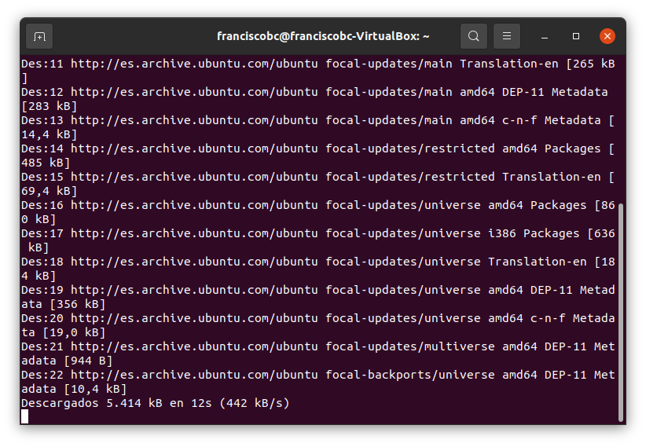
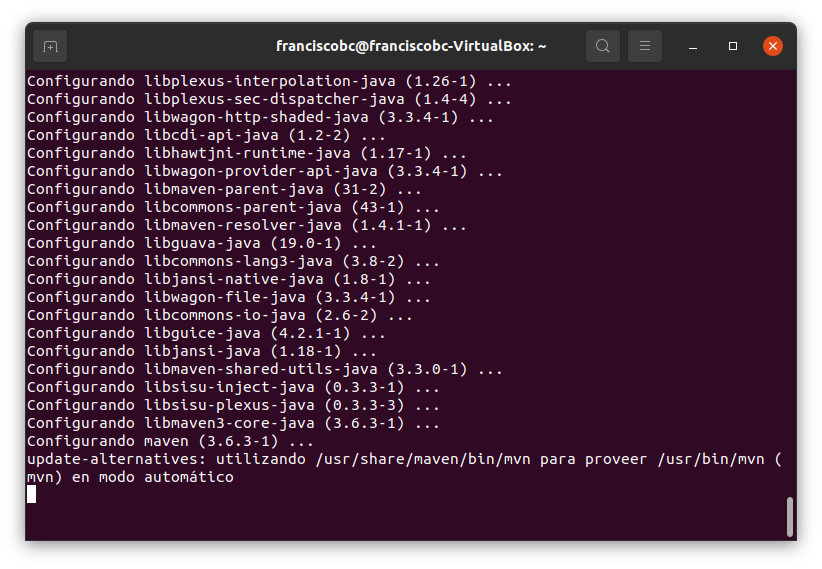
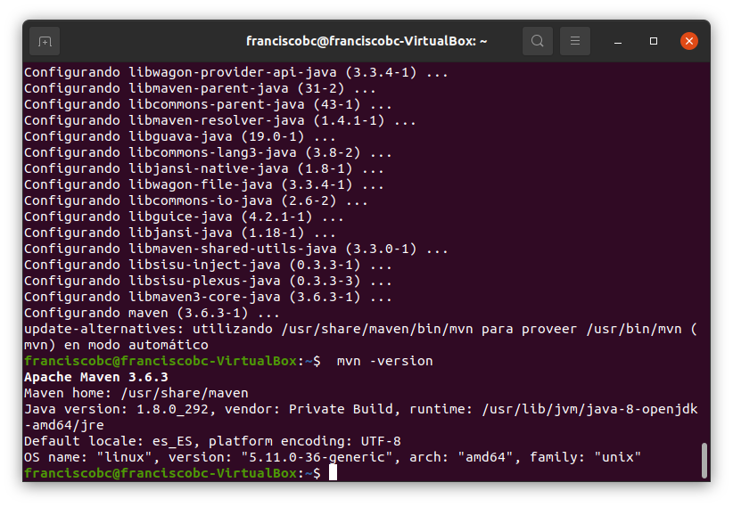

# Instalación de Maven en Linux

## Paso1. Actualización e instalación
Se ingresaron los comandos:
sudo apt update
  
 
 
## Paso2. La instalación de maven
sudo apt install Maven 
 
 
 
## Paso3. Verificar versión
Con los comandos:
mvn -version
dio este resultado: 
Me da una versión de 3.6.3 como se esperaba según los apuntes indicados.

 
## Paso4. Actualizar a la versión 3.8.2
Se indicaba bajar la versión mas reciente desde la pagina oficial y la descargue a descargas de la máquina virtual.
Seguí las indicaciones para instalar la carpeta extraída en el directorio opt, pero de ninguna de las maneras me daba permiso para copiarlo.
Pasé mucho tiempo tratando de encontrar información que me ayudara a conseguir el permiso pero siempre me dice que no soy un administrador.

Nota:
Tampoco conseguí aun buscando en multitud de sitios, copiar archivos desde la maquina virtual al pc o viceversa. Seguía todos los pasos, pero me da un error. 
Lo mismo crear una carpeta compartida, no me daba los permisos. 
O conseguir que viera el disco duro de trabajo en clase como disco o carpetas compartidas.
